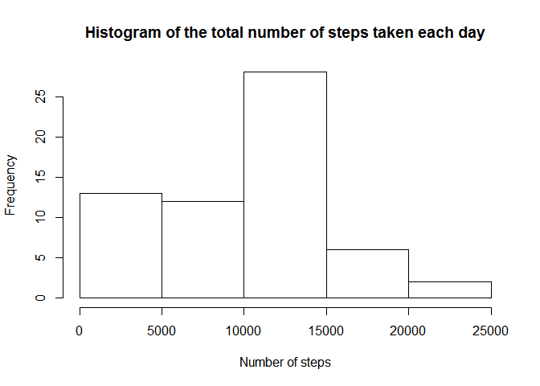
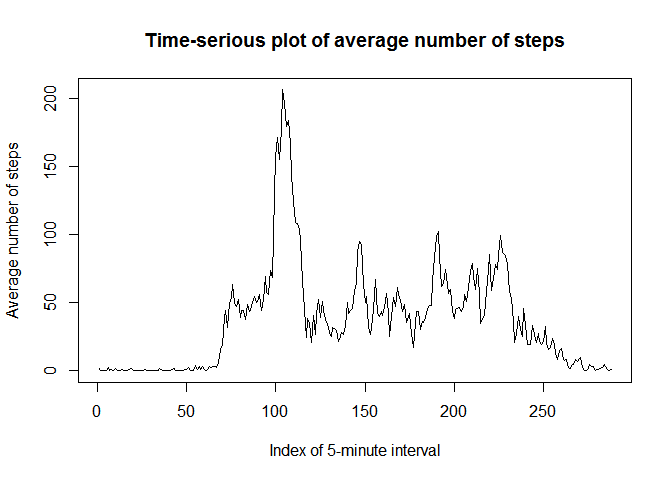
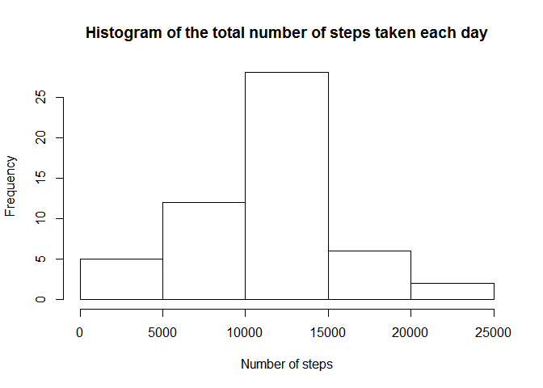
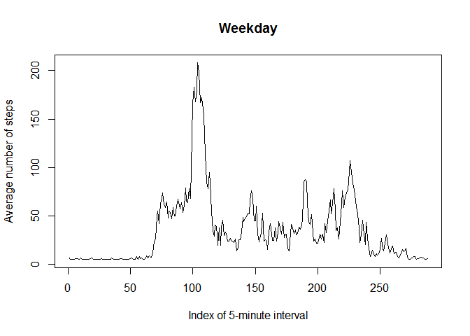
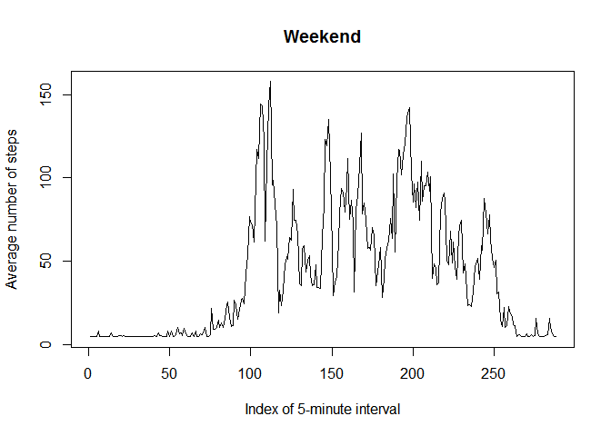

Loading and preprocessing the data
----------------------------------

Loading the data

    activity <- read.table("activity.csv", sep = ",", header = TRUE)
    head(activity)

    ##   steps       date interval
    ## 1    NA 2012-10-01        0
    ## 2    NA 2012-10-01        5
    ## 3    NA 2012-10-01       10
    ## 4    NA 2012-10-01       15
    ## 5    NA 2012-10-01       20
    ## 6    NA 2012-10-01       25

    summary(activity)

    ##      steps                date          interval     
    ##  Min.   :  0.00   2012-10-01:  288   Min.   :   0.0  
    ##  1st Qu.:  0.00   2012-10-02:  288   1st Qu.: 588.8  
    ##  Median :  0.00   2012-10-03:  288   Median :1177.5  
    ##  Mean   : 37.38   2012-10-04:  288   Mean   :1177.5  
    ##  3rd Qu.: 12.00   2012-10-05:  288   3rd Qu.:1766.2  
    ##  Max.   :806.00   2012-10-06:  288   Max.   :2355.0  
    ##  NA's   :2304     (Other)   :15840

What is mean total number of steps taken per day?
-------------------------------------------------

1.  Calculate the total number of steps taken per day

<!-- -->

    tapply(activity$step, activity$date, sum,na.rm = TRUE)

    ## 2012-10-01 2012-10-02 2012-10-03 2012-10-04 2012-10-05 2012-10-06 
    ##          0        126      11352      12116      13294      15420 
    ## 2012-10-07 2012-10-08 2012-10-09 2012-10-10 2012-10-11 2012-10-12 
    ##      11015          0      12811       9900      10304      17382 
    ## 2012-10-13 2012-10-14 2012-10-15 2012-10-16 2012-10-17 2012-10-18 
    ##      12426      15098      10139      15084      13452      10056 
    ## 2012-10-19 2012-10-20 2012-10-21 2012-10-22 2012-10-23 2012-10-24 
    ##      11829      10395       8821      13460       8918       8355 
    ## 2012-10-25 2012-10-26 2012-10-27 2012-10-28 2012-10-29 2012-10-30 
    ##       2492       6778      10119      11458       5018       9819 
    ## 2012-10-31 2012-11-01 2012-11-02 2012-11-03 2012-11-04 2012-11-05 
    ##      15414          0      10600      10571          0      10439 
    ## 2012-11-06 2012-11-07 2012-11-08 2012-11-09 2012-11-10 2012-11-11 
    ##       8334      12883       3219          0          0      12608 
    ## 2012-11-12 2012-11-13 2012-11-14 2012-11-15 2012-11-16 2012-11-17 
    ##      10765       7336          0         41       5441      14339 
    ## 2012-11-18 2012-11-19 2012-11-20 2012-11-21 2012-11-22 2012-11-23 
    ##      15110       8841       4472      12787      20427      21194 
    ## 2012-11-24 2012-11-25 2012-11-26 2012-11-27 2012-11-28 2012-11-29 
    ##      14478      11834      11162      13646      10183       7047 
    ## 2012-11-30 
    ##          0

1.  Make a histogram of the total number of steps taken each day

<!-- -->

    hist(tapply(activity$step, activity$date, sum,na.rm = TRUE),main="Histogram of the total number of steps taken each day",xlab="Number of steps")

<!-- -->

1.  Calculate and report the mean and median of the total number of
    steps taken per day

-   The mean of the total number of steps taken per day

<!-- -->

    x <- tapply(activity$step, activity$date, sum,na.rm = TRUE)
    x <- as.vector(x)
    mean(x)

    ## [1] 9354.23

-   The median of the total number of steps taken per day

<!-- -->

    median(x)

    ## [1] 10395

What is the average daily activity pattern?
-------------------------------------------

1.  Make a time series plot (i.e. type = "l") of the 5-minute interval
    (x-axis) and the average number of steps taken, averaged across all
    days (y-axis)

<!-- -->

    g <- split(activity$steps,activity$interval)
    plot(sapply(g,mean,na.rm = TRUE),type = "l",main="Time-serious plot of average number of steps",ylab = "Average number of steps",xlab="Index of 5-minute interval")

<!-- -->

1.  Which 5-minute interval, on average across all the days in the
    dataset, contains the maximum number of steps?

<!-- -->

    f <- as.numeric(sapply(g,mean,na.rm = TRUE))
    max(f)

    ## [1] 206.1698

    imax = 0
    for (i in 1:length(f)) {
      if (f[i] == max(f)){
        imax = i
        break
      }
    }
    imax

    ## [1] 104

Imputing missing values
-----------------------

1.  Calculate and report the total number of missing values in the
    dataset (i.e. the total number of rows with NAs)

<!-- -->

    sapply(activity, function(x) sum(is.na(x)))

    ##    steps     date interval 
    ##     2304        0        0

The total number of missing values in the dataset:

    row.has.na <- apply(activity, 1, function(x){any(is.na(x))})
    sum(row.has.na)

    ## [1] 2304

1.  Devise a strategy for filling in all of the missing values in the
    dataset

We will use the mean for attribute in the entire dataset to fill the
missing values for any given day.

1.  Create a new dataset that is equal to the original dataset but with
    the missing data filled in

<!-- -->

    activitynew <- activity # a new dataset
    y <- tapply(activitynew$step, activitynew$date, mean,na.rm = TRUE)
    activitynew$steps[which(is.na(activitynew$steps))] <- mean(y[is.finite(y)])

The total number of missing values in the new dataset:

    row.has.na <- apply(activitynew, 1, function(x){any(is.na(x))})
    sum(row.has.na)

    ## [1] 0

1.  Make a histogram of the total number of steps taken each day

<!-- -->

    hist(tapply(activity$step, activitynew$date, sum),main="Histogram of the total number of steps taken each day",xlab="Number of steps")

<!-- -->
Calculate and report the mean and median total number of steps taken per
day.

    x <- tapply(activitynew$step, activitynew$date, sum)
    x <- as.vector(x)
    mean(x)

    ## [1] 10766.19

-   The median of the total number of steps taken per day

<!-- -->

    median(x)

    ## [1] 10766.19

Do these values differ from the estimates from the first part of the
assignment?

Yes, these values differ from the estimates from the first part of the
assignment.

What is the impact of imputing missing data on the estimates of the
total daily number of steps?

Now the mean and median of the total number of steps taken per day are
equal.

Are there differences in activity patterns between weekdays and weekends?
-------------------------------------------------------------------------

1.  Create a new factor variable in the dataset with two levels -
    "weekday" and "weekend" indicating whether a given date is a weekday
    or weekend day.

<!-- -->

    activitynew$date <- as.Date(activitynew$date)
    weekdays1 <- c('Monday', 'Tuesday', 'Wednesday', 'Thursday', 'Friday')
    activitynew$wDay <- c('weekend', 'weekday')[(weekdays(activitynew$date) %in% weekdays1)+1L]
    head(activitynew)

    ##     steps       date interval    wDay
    ## 1 37.3826 2012-10-01        0 weekday
    ## 2 37.3826 2012-10-01        5 weekday
    ## 3 37.3826 2012-10-01       10 weekday
    ## 4 37.3826 2012-10-01       15 weekday
    ## 5 37.3826 2012-10-01       20 weekday
    ## 6 37.3826 2012-10-01       25 weekday

1.  Make a panel plot containing a time series plot (i.e. type = "l") of
    the 5-minute interval (x-axis) and the average number of steps
    taken, averaged across all weekday days or weekend days (y-axis).

<!-- -->

    z <- split(activitynew, activitynew$wDay)
    names(z)

    ## [1] "weekday" "weekend"

    head(z$weekday)

    ##     steps       date interval    wDay
    ## 1 37.3826 2012-10-01        0 weekday
    ## 2 37.3826 2012-10-01        5 weekday
    ## 3 37.3826 2012-10-01       10 weekday
    ## 4 37.3826 2012-10-01       15 weekday
    ## 5 37.3826 2012-10-01       20 weekday
    ## 6 37.3826 2012-10-01       25 weekday

    head(z$weekend)

    ##      steps       date interval    wDay
    ## 1441     0 2012-10-06        0 weekend
    ## 1442     0 2012-10-06        5 weekend
    ## 1443     0 2012-10-06       10 weekend
    ## 1444     0 2012-10-06       15 weekend
    ## 1445     0 2012-10-06       20 weekend
    ## 1446     0 2012-10-06       25 weekend

    g <- split(z$weekday$steps,z$weekday$interval)
    plot(sapply(g,mean),type = "l",main="Weekday",ylab = "Average number of steps",xlab="Index of 5-minute interval")

<!-- -->

    g1 <- split(z$weekend$steps,z$weekend$interval)
    plot(sapply(g1,mean),type = "l",main="Weekend",ylab = "Average number of steps",xlab="Index of 5-minute interval")

<!-- -->
